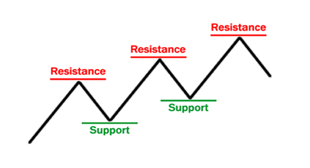
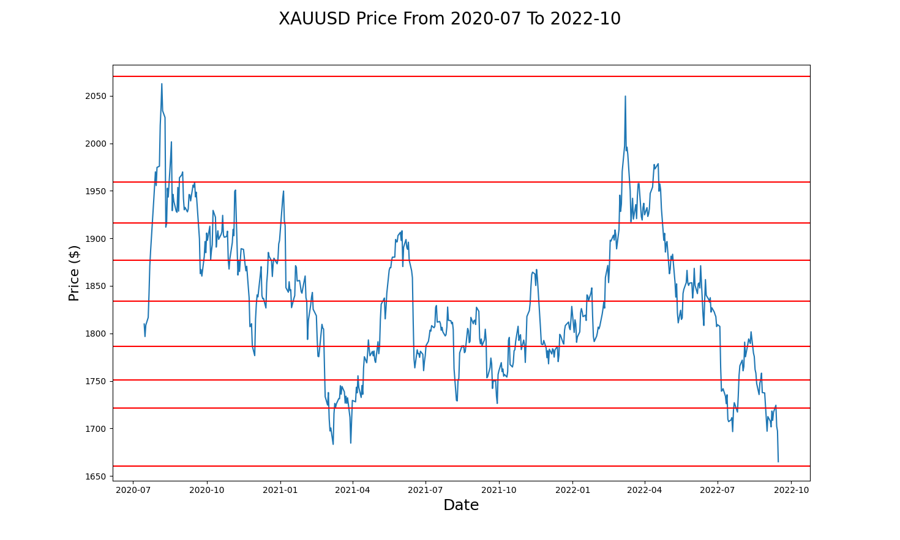

# support_and_resistance_finder

<!-- Improved compatibility of back to top link: See: https://github.com/othneildrew/Best-README-Template/pull/73 -->
<a name="readme-top"></a>


<!-- PROJECT LOGO -->
<br />
<div align="center">
  <a href="https://github.com/kennychavz/support_and_resistance_finder">
    
  </a>

<h3 align="center">Support And Resistance Finder</h3>

  <p align="center">
    This software automatically finds support and resistance levels when given a candlestick dataframe
    <br />
    <a href="https://github.com/kennychavz/support_and_resistance_finder"><strong>Explore the docs »</strong></a>
    <br />
    <br />
    <a href="https://github.com/kennychavz/support_and_resistance_finder">View Demo</a>
    ·
    <a href="https://github.com/kennychavz/support_and_resistance_finder/issues">Report Bug</a>
    ·
    <a href="https://github.com/kennychavz/support_and_resistance_finder/issues">Request Feature</a>
  </p>
</div>


<!-- TABLE OF CONTENTS -->
<details>
  <summary>Table of Contents</summary>
  <ol>
    <li>
      <a href="#about-the-project">About The Project</a>
      <ul>
      </ul>
    </li>
    <li>
      <a href="#getting-started">Getting Started</a>
      <ul>
        <li><a href="#prerequisites">Prerequisites</a></li>
        <li><a href="#installation">Installation</a></li>
      </ul>
    </li>
    <li><a href="#usage">Usage</a></li>
    <li><a href="#roadmap">Roadmap</a></li>
    <li><a href="#contributing">Contributing</a></li>
    <li><a href="#license">License</a></li>
    <li><a href="#contact">Contact</a></li>
  </ol>
</details>


<!-- ABOUT THE PROJECT -->
### About The Project



This project was made to serve as a foundation to the automation of traditional technical analysis trading. Support and resistance levels, also called supply and demand levels are the key foundation when it comes to trading as they structure the way financial markets move. The idea behind this project was wheter we could automate a task that institutions have been doing manually for the last century.


<p align="right">(<a href="#readme-top">back to top</a>)</p>


<!-- GETTING STARTED -->
## Getting Started

To get a local copy up and running follow these simple example steps.

### Prerequisites

This is an example of how to list things you need to use the software and how to install them.
* npm
  ```sh
  sudo apt install python3.10 python-pip
  ```
* pip
  ```sh
  curl https://bootstrap.pypa.io/get-pip.py -o /tmp/get-pip.py
  sudo python3.8 /tmp/get-pip.py
  ```

### Installation

1. Get a free API Key at [https://example.com](https://example.com)
2. Clone the repo
   ```sh
   git clone https://github.com/kennychavz/support_and_resistance_finder.git
   ```
3. Install requirements
   ```sh
   pip3 install -r requirements.txt
   ```
4. Pass a dataframe to the main function inside of app.py
   ```py
   df = pandas.dataframe_of_your_choice
   ```
5. Run the program
   ```py
   python app.py
   ```

<p align="right">(<a href="#readme-top">back to top</a>)</p>


<!-- USAGE EXAMPLES -->
## Usage

Use this space to show useful examples of how a project can be used. Additional screenshots, code examples and demos work well in this space. You may also link to more resources.

To use the support and resistance finder, make sure to pass the software a dataframe containing the dates aswell as the high, low and close prices. 

You can use this with any instrument in any sector (Stocks, Forex, Crypto, etc)

To get a further understanding of support and resistance levels make sure to visit [investopedia](https://www.investopedia.com/trading/support-and-resistance-basics/) and [babypips](https://www.babypips.com/learn/forex/support-and-resistance).

<p align="right">(<a href="#readme-top">back to top</a>)</p>


<!-- ROADMAP -->
## Roadmap

- [ ] Feature 1: Extending the support and resistance finder to find levels with any sized dataframe instead of a 500-1500 point dataframe
- [ ] Feature 2: 

See the [open issues](https://github.com/kennychavz/support_and_resistance_finder/issues) for a full list of proposed features (and known issues).

<p align="right">(<a href="#readme-top">back to top</a>)</p>


<!-- CONTRIBUTING -->
## Contributing

Contributions are what make the open source community such an amazing place to learn, inspire, and create. Any contributions you make are **greatly appreciated**.

If you have a suggestion that would make this better, please fork the repo and create a pull request. You can also simply open an issue with the tag "enhancement".
Don't forget to give the project a star! Thanks again!

1. Fork the Project
2. Create your Feature Branch (`git checkout -b feature/AmazingFeature`)
3. Commit your Changes (`git commit -m 'Add some AmazingFeature'`)
4. Push to the Branch (`git push origin feature/AmazingFeature`)
5. Open a Pull Request

<p align="right">(<a href="#readme-top">back to top</a>)</p>


<!-- LICENSE -->
## License

Distributed under the MIT License. See `LICENSE.txt` for more information.

<p align="right">(<a href="#readme-top">back to top</a>)</p>


<!-- CONTACT -->
## Contact

Kenny Chavez - kennychavez.mtl@gmail.com

support_and_resistance_finder: [https://github.com/kennychavz/support_and_resistance_finder](https://github.com/kennychavz/support_and_resistance_finder)

<p align="right">(<a href="#readme-top">back to top</a>)</p>


<!-- MARKDOWN LINKS & IMAGES -->
<!-- https://www.markdownguide.org/basic-syntax/#reference-style-links -->
[contributors-shield]: https://img.shields.io/github/contributors/kennychavz/support_and_resistance_finder.svg?style=for-the-badge
[contributors-url]: https://github.com/kennychavz/support_and_resistance_finder/graphs/contributors
[forks-shield]: https://img.shields.io/github/forks/kennychavz/support_and_resistance_finder.svg?style=for-the-badge
[forks-url]: https://github.com/kennychavz/support_and_resistance_finder/network/members
[stars-shield]: https://img.shields.io/github/stars/kennychavz/support_and_resistance_finder.svg?style=for-the-badge
[stars-url]: https://github.com/kennychavz/support_and_resistance_finder/stargazers
[issues-shield]: https://img.shields.io/github/issues/kennychavz/support_and_resistance_finder.svg?style=for-the-badge
[issues-url]: https://github.com/kennychavz/support_and_resistance_finder/issues
[license-shield]: https://img.shields.io/github/license/kennychavz/support_and_resistance_finder.svg?style=for-the-badge
[license-url]: https://github.com/kennychavz/support_and_resistance_finder/blob/master/LICENSE.txt
[linkedin-shield]: https://img.shields.io/badge/-LinkedIn-black.svg?style=for-the-badge&logo=linkedin&colorB=555
[linkedin-url]: https://linkedin.com/in/kennychavezmtl
[product-screenshot]: images/screenshot.png
[Python-url]: https://www.python.org
